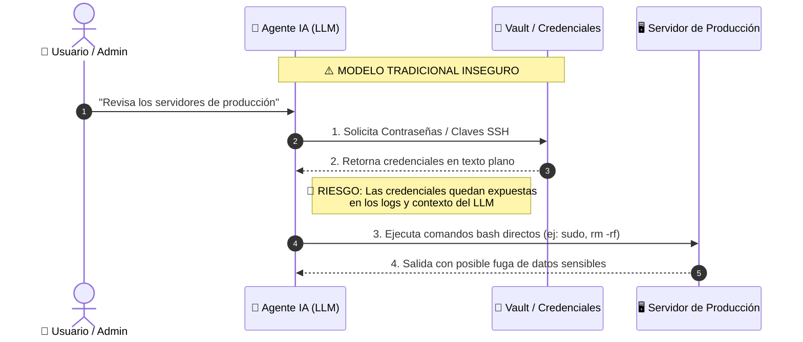
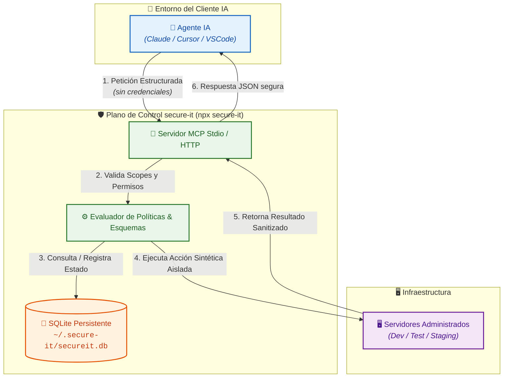

# 🛡️ secure-it: Agente Seguro para Operar Infraestructura (Guía DIY)

> **Plano de control y servidor MCP (Model Context Protocol) para operar infraestructura sin exponer contraseñas, claves privadas ni tokens al agente de IA.**

---

## 📊 Descripción Gráfica: El Problema vs La Solución

### ❌ El Problema Tradicional (Inseguro)

Cuando se le otorgan credenciales directas o acceso a terminal bash a un agente de IA:



* 🚨 **Fuga de Credenciales**: Las contraseñas quedan almacenadas en el contexto de la conversación.
* 🚨 **Falta de Control**: El agente puede ejecutar comandos destructivos o no autorizados.

---

### ✅ La Solución con `secure-it` (Zero-Credentials to AI)

`secure-it` actúa como un plano de control seguro y aislado entre el agente y la infraestructura:



* 🛡️ **Zero-Secrets**: El agente **NUNCA** recibe ni manipula claves privadas ni contraseñas.
* 🛡️ **Validación Estricta**: Todas las acciones requieren aprobación de esquemas y comprobación de permisos.
* 🛡️ **Auditoría Local**: Registro persistente e inmutable de todas las operaciones en SQLite.

---

## 🚀 Guía "Hazlo Tú Mismo" (DIY Step-by-Step)

Sigue estos sencillos pasos para tener tu servidor MCP de infraestructura operando en menos de 2 minutos.

### 📋 Prerrequisito
- **Node.js 22.0.0 o posterior** instalado (`node -v`).
- **No requiere Docker Desktop ni base de datos externa**. Todo funciona 100% autónomo con `npx` y SQLite embebido.

---

### 1️⃣ Paso 1: Ejecución Directa con `npx`

Puedes probar el servidor directamente desde tu terminal o clonando este repositorio:

```bash
# Opción A: Ejecución desde el repositorio clonado
npx .

# Opción B: Mediante npm script
npm run mcp
```

*Al iniciar por primera vez, `secure-it` creará automáticamente el directorio local `~/.secure-it/` con la base de datos `secureit.db` y datos sintéticos de demostración.*

---

### 2️⃣ Paso 2: Configurar tu Cliente MCP (Claude Desktop / Cursor / VSCode)

Agrega la configuración del servidor a tu cliente de IA preferido:

#### 🤖 En Claude Desktop
Abre o crea el archivo de configuración:
- **macOS**: `~/Library/Application Support/Claude/claude_desktop_config.json`
- **Windows**: `%APPDATA%\Claude\claude_desktop_config.json`
- **Linux**: `~/.config/Claude/claude_desktop_config.json`

Agrega el bloque en `mcpServers`:

```json
{
  "mcpServers": {
    "secure-it": {
      "command": "npx",
      "args": ["-y", "@secure-it/mcp"]
    }
  }
}
```

*O si deseas usar la copia local del código:*

```json
{
  "mcpServers": {
    "secure-it": {
      "command": "npx",
      "args": ["."],
      "cwd": "/ruta/absoluta/a/tu/secure-it"
    }
  }
}
```

#### 💻 En Cursor / VSCode Agent / Windsurf
Añade la herramienta MCP en la configuración de extensiones MCP con:
- **Command**: `npx`
- **Args**: `.` (o `-y @secure-it/mcp`)
- **Working Directory**: `/ruta/a/secure-it`

---

### 3️⃣ Paso 3: Probar las Herramientas en el Chat

Una vez guardada la configuración y reiniciado el cliente, puedes pedirle a Claude o a tu asistente comandos como:

#### 🟢 Consulta de Inventario y Servidores
> *"Lista todos los servidores registrados en el entorno de pruebas"*

El agente utilizará automáticamente la herramienta `secureit.servers.list`.

#### 🟢 Consultar Estado de un Servidor
> *"Muestra los detalles del servidor 20000000-0000-4000-8000-000000000001"*

El agente invocará `secureit.servers.get`.

#### 🟢 Ejecutar una Acción Diagnóstica
> *"Ejecuta la acción os.disk_usage en el servidor web-test-01.example para revisar el punto de montaje /var"*

El agente invocará `secureit.ssh.execute_action` con parámetros validados por esquema.

#### 🟢 Registrar un Nuevo Servidor
> *"Registra un nuevo servidor llamado db-staging-01.example en el ambiente test con el perfil de acceso 10000000-0000-4000-8000-000000000001"*

El agente invocará `secureit.servers.add`, creando el registro en tu base de datos SQLite local.

---

## 🛠️ Herramientas MCP Disponibles (Catálogo)

`secure-it` publica 12 herramientas MCP filtradas por permisos (scopes):

| Categogía | Herramienta MCP | Descripción |
| :--- | :--- | :--- |
| **Servidores** | `secureit.servers.list` | Listar servidores del inventario con filtros de ambiente y etiquetas. |
| | `secureit.servers.get` | Obtener metadatos detallados de un servidor específico. |
| | `secureit.servers.add` | Registrar un nuevo servidor para enrolamiento. |
| | `secureit.servers.enrollment_status` | Consultar estado de enrolamiento y verificación. |
| | `secureit.servers.verify` | Verificar la identidad y binding de un servidor enrolado. |
| **Perfiles** | `secureit.access_profiles.list` | Listar perfiles de acceso autorizados por ambiente. |
| **Acciones** | `secureit.actions.list` | Consultar catálogo de acciones permitidas y sus esquemas JSON. |
| | `secureit.ssh.execute_action` | Ejecutar una acción tipada y preaprobada sobre uno o varios servidores. |
| | `secureit.ssh.execute_command` | Solicitar la ejecución de un comando especial (requiere aprobación). |
| **Trabajos** | `secureit.jobs.get` | Consultar estado y salida filtrada de un trabajo ejecutado. |
| | `secureit.jobs.cancel` | Cancelar un trabajo en cola o pendiente. |
| **Credenciales** | `secureit.credentials.rotate` | Solicitar la rotación ciega de credenciales sin revelar el secreto. |

---

## 💻 Comandos de Desarrollo y Pruebas

Para desarrolladores que deseen probar o modificar el código fuente:

```bash
# Compilar todos los paquetes TypeScript
npm run build

# Verificar la calidad del código y tipos estrictos
npm run lint

# Ejecutar la suite completa de pruebas unitarias e integración
npm run check

# Probar el servidor stdio manualmente
npm run mcp
```

---

## 🔒 Arquitectura de Seguridad Avanzada

Si deseas desplegar `secure-it` en un servidor remoto con soporte OAuth/OIDC y contenedores aislados:

- **Streamable HTTP + OIDC**: Inicia con `npm run dev:mcp:http` especificando variables OIDC (`SECUREIT_OIDC_ISSUER`, `SECUREIT_OIDC_AUDIENCE`).
- **PostgreSQL & OPA en Docker**: Inicia los servicios con `make demo` (usa `compose.yaml`).

---

## 📚 Documentación Técnica Detallada

Para comprender a fondo el diseño de seguridad y especificaciones:

- [01. Objetivos, Requisitos y Límites](docs/01-requisitos-y-limites.md)
- [02. Arquitectura de Referencia](docs/02-arquitectura.md)
- [03. Modelo de Datos](docs/03-modelo-de-datos.md)
- [04. Modelo de Amenazas y Controles](docs/04-modelo-de-amenazas.md)
- [05. Contrato de Acciones y API](docs/05-contrato-de-acciones.md)
- [06. Plan de Implementación y Operación](docs/06-plan-de-implementacion.md)
- [07. Rotación y Recuperación de Credenciales](docs/07-rotacion-de-credenciales.md)
- [08. Ejecución Ciega y Capacidades Temporales](docs/08-ejecucion-ciega.md)
- [09. Diseño del Servidor MCP](docs/09-servidor-mcp.md)
- [10. Interfaz Administrativa de Credenciales](docs/10-interfaz-administrativa-credenciales.md)
