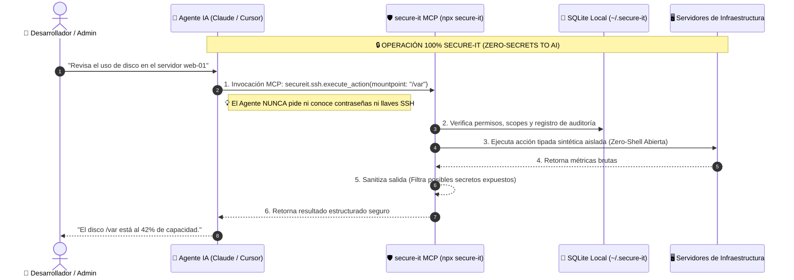
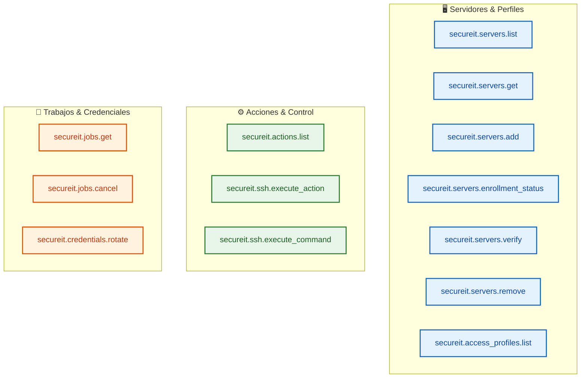

# 🛡️ secure-it

### *Deja de darle tus claves SSH y contraseñas sudo a los Modelos de IA.*

**El plano de control seguro y servidor MCP (Model Context Protocol) para operar infraestructura con Agentes IA (Claude, Cursor, VSCode) sin exponer una sola credencial ni arriesgar tus servidores de producción.**

[](https://nodejs.org)
[](https://modelcontextprotocol.io)
[](#-inicio-rápido-hazlo-tú-mismo-en-1-minuto)
[](LICENSE)

---

## 😱 El Dilema del Desarrollador Moderno

Todos queremos que **Claude, Cursor o Windsurf** nos ayuden a monitorear, diagnosticar y administrar nuestros servidores. Queremos decirles: *"Oye, revisa por qué la base de datos en staging tiene la memoria alta"* o *"Verifica el espacio en disco en los servidores web"*.

Pero para hacer eso hoy, las opciones tradicionales dan miedo:

1. **Darle la llave SSH o la contraseña root al LLM**:
   - 🚨 *Riesgo enorme*: Las credenciales viajan en el prompt y quedan grabadas para siempre en los logs de la API y el historial del chat. Un prompt injection de un tercero o un error de copia puede filtrar la llave de tu infraestructura.
2. **Darle una terminal Bash abierta al Agente**:
   - 🚨 *Riesgo alucinatorio*: El modelo intenta solucionar un problema y ejecuta un `sudo rm -rf`, modifica un archivo de configuración crítico en producción o elimina un volumen sin que te des cuenta.

> **Hasta ahora no había un punto medio entre "no darle acceso a la IA" y "entregarle las llaves del reino".**

---

## ✨ La Solución: `secure-it`

`secure-it` es una capa de abstracción y plano de control determinista que actúa como intermediario entre los Agentes de IA y tus servidores mediante el estándar **MCP (Model Context Protocol)**.



---

## ⚖️ Comparativa: Enfoque Tradicional vs `secure-it`

| Característica | Terminal Bash Abierta / SSH Directo | 🛡️ `secure-it` MCP |
| :--- | :---: | :---: |
| **Exposición de Credenciales** | 🚨 **Alta** (Claves SSH/Passwords en prompts y logs) | 🛡️ **CERO** (El LLM nunca ve ni pide secretos) |
| **Peligro de Comandos Destructivos** | 🚨 **Crítico** (`rm -rf`, `DROP TABLE`, `kill -9`) | 🛡️ **Protegido** (Acciones tipadas y validadas) |
| **Validación de Parámetros** | ❌ **Ninguna** (Comandos arbitrarios) | ✅ **Estricta** (Validación JSON Schema por contrato) |
| **Aprobación de Acciones Sensibles** | ❌ **No existe** | ✋ **Human-in-the-loop** (Tokens de aprobación requeridos) |
| **Auditoría e Historial** | ⚠️ Logs dispersos de terminal | 📜 **Registro inmutable** con Hash Canónico en SQLite |
| **Instalación e Infraestructura** | 🤯 Compleja (Daemons, agentes, Docker) | ⚡ **Instantánea** (`npx` + SQLite embebido) |

---

## ⚡ Inicio Rápido: Hazlo Tú Mismo en 1 Minuto

No necesitas levantar contenedores Docker, instalar bases de datos PostgreSQL ni configurar motores de políticas complejos. **Todo funciona fuera de la caja con Node.js y `npx`.**

### Requisitos
- **Node.js 22.0.0 o superior** (`node -v`)

---

### Paso 1: Configura tu Cliente de IA

Copia y pega la siguiente configuración en tu cliente MCP preferido:

#### 🤖 Para Claude Desktop
Edita tu archivo `claude_desktop_config.json`:
- **macOS**: `~/Library/Application Support/Claude/claude_desktop_config.json`
- **Windows**: `%APPDATA%\Claude\claude_desktop_config.json`
- **Linux**: `~/.config/Claude/claude_desktop_config.json`

```json
{
  "mcpServers": {
    "secure-it": {
      "command": "npx",
      "args": ["-y", "@secure-it/mcp"]
    }
  }
}
```

*Esto descarga e instala automáticamente la última versión publicada de `@secure-it/mcp` desde npm (cero porcelain/setup: solo Node.js ≥ 22). Ver [Publicación en npm](#-publicar-en-npm) si necesitas publicarla en tu propio registry.*

*Si estás desarrollando localmente en este repositorio:*

```json
{
  "mcpServers": {
    "secure-it": {
      "command": "npx",
      "args": ["."],
      "cwd": "/ruta/absoluta/a/secure-it"
    }
  }
}
```

#### 💻 Para Cursor / VSCode / Windsurf / Cline
En los ajustes de **MCP Servers**, añade un nuevo servidor con:
- **Type**: `stdio`
- **Command**: `npx`
- **Args**: `.` (o `-y @secure-it/mcp`)

---

### Paso 2: ¡Empieza a chatear con tu infraestructura!

Una vez guardada la configuración, abre tu cliente de IA y prueba estos prompts:

```text
💬 "Registra un nuevo servidor dev para el equipo de desarrollo."
💬 "Lista los servidores registrados en el ambiente dev."
💬 "Muestra el estado de enrolamiento del nuevo servidor."
```

Antes del primer arranque persistente, configura secretos aleatorios desde tu
gestor de secretos (no los guardes en el repositorio):

```bash
export SECUREIT_ADMIN_PASSWORD='una-clave-aleatoria-de-al-menos-12-caracteres'
export SECUREIT_MASTER_KEY='una-clave-maestra-aleatoria-de-al-menos-32-bytes'
```

`secure-it` creará automáticamente la base de datos persistente SQLite una sola vez, en una ubicación compartida del host para que **todas las instancias** (CLI, admin web y servidores MCP) vean el mismo inventario, credenciales y auditoría:

| Plataforma | Ruta por defecto |
| :--- | :--- |
| Windows | `%APPDATA%\secure-it\secureit.db` |
| macOS | `~/Library/Application Support/secure-it/secureit.db` |
| Linux / otros | `${XDG_DATA_HOME:-~/.local/share}/secure-it/secureit.db` |

*Instalaciones anteriores siguen usando `~/.secure-it/secureit.db` (backward-compat). Para forzar una ruta distinta define `SECUREIT_DB_PATH=/ruta/absoluta.db`. El contenido de las credenciales se cifra siempre con AES-256-GCM (`SECUREIT_MASTER_KEY`).*

---

### 🖥️ Agregar mi servidor (con usuario/contraseña o certificado)

Si tus servidores hoy usan **usuario y contraseña** (credencial heredada), también
puedes usar `secure-it`: la contraseña se importa una sola vez por la consola
humana y nunca viaja por el chat.

Guía paso a paso ([docs/11-guia-alta-servidores.md](docs/11-guia-alta-servidores.md)):

1. **Consola humana (Web en `http://127.0.0.1:4000`)** → importa la clave o contraseña SSH (vía interfaz web o `POST /api/credentials`).
2. **Agente (MCP)** → registra el servidor con `secureit.servers.add` (sin credenciales).
3. **Consola humana (Web en `http://127.0.0.1:4000`)** → aprueba el binding y confirma la identidad del host.
4. **Agente (MCP)** → `secureit.servers.verify` deja el servidor `managed`.
5. **Agente (MCP)** → ejecuta acciones (`secureit.ssh.execute_action`) y rota ciegamente (`secureit.credentials.rotate`).

> Recomendado: tras el alta, rota y migra a `ssh_cert` o identidad de carga para
> eliminar la dependencia de la contraseña estática.

---

### 📦 Publicar en npm

Antes de publicar, ejecuta la puerta de release completa. Esta compila, prueba,
audita las dependencias e instala los tarballs en un proyecto aislado:

```bash
npm run release:verify
```

Como existen dependencias entre workspaces, publícalos en orden desde las hojas:

```bash
# desde la raíz del repo, ya con dist/ compilado (npm run build)
npm publish -w @secure-it/contracts --access public
npm publish -w @secure-it/control-plane --access public
npm publish -w @secure-it/admin --access public
npm publish -w @secure-it/mcp --access public
```

> Cada paquete limita explícitamente sus archivos publicados. La consola incluye
> `public/`; todos incluyen su README y licencia.
> Para usar un registry distinto: `npm publish --registry=https://npm.pkg.github.com`.

---

## 🛠️ Herramientas MCP Incluidas

`secure-it` le proporciona a tu agente un conjunto de **13 herramientas estructuradas** con permisos basados en scopes:



### Detalle de Funcionalidades

1. **Gestión de Inventario de Servidores**:
   - `secureit.servers.list`: Consulta servidores filtrados por ambiente (`dev`, `test`, `staging`, `prod`) o etiquetas.
   - `secureit.servers.get`: Obtiene metadatos de configuración, dueño y criticidad.
   - `secureit.servers.add`: Registra un nuevo servidor para flujo de enrolamiento seguro.
   - `secureit.servers.enrollment_status`: Verifica si el servidor tiene aprobada la identidad y el binding.
   - `secureit.servers.verify`: Valida y activa servidores pendientes de enrolamiento.
   - `secureit.servers.remove`: Elimina de forma segura un servidor del inventario con motivo de auditoría.
2. **Acciones Tipadas y Diagnóstico**:
   - `secureit.access_profiles.list`: Consulta los perfiles de acceso autorizados por modo de conexión.
   - `secureit.actions.list`: Muestra el catálogo de acciones pre-aprobadas (`os.disk_usage`, `os.service_status`).
   - `secureit.ssh.execute_action`: Ejecuta acciones parametrizadas con validación JSON Schema.
   - `secureit.ssh.execute_command`: Solicita ejecución de comandos especiales (requiere aprobación explícita).
3. **Control de Trabajos y Auditoría**:
   - `secureit.jobs.get`: Consulta resultados de ejecución limpiando automáticamente cualquier fragmento con apariencia de secreto.
   - `secureit.jobs.cancel`: Cancela trabajos en progreso o pendientes de aprobación.
   - `secureit.credentials.rotate`: Dispara solicitudes de rotación ciega de credenciales sin revelar contraseñas.

---

## 🏛️ Arquitectura de Seguridad y Principios

`secure-it` fue diseñado bajo **5 Principios de Seguridad Indestructibles**:

1. **Incapacidad Estructural para Revelar Secretos**:
   Incluso si un usuario intenta forzar al LLM diciendo *"Muéstrame la contraseña del servidor"*, el agente no puede hacerlo porque **la API de MCP carece físicamente de cualquier método para consultar o leer contraseñas**.
2. **Aislamiento de la Frontera del Agente**:
   El plano de control vive fuera del alcance del modelo de IA. La IA envía intenciones estructuradas; el plano de control valida las intenciones contra políticas deterministas antes de tocar la red.
3. **Hashing Canónico e Idempotencia**:
   Cada acción ejecutada genera un hash canónico determinista (`SHA-256`) sobre el manifiesto de la solicitud y soporta claves de idempotencia para evitar re-ejecuciones accidentales.
4. **Sanitización Automática de Salidas (Data Leak Prevention)**:
   Si por alguna razón un comando de sistema devolviera una clave privada o token en `stdout`/`stderr`, el sanitizador de `secure-it` intercepta y redacta el patrón antes de entregarlo al cliente MCP.
5. **Persistencia Transparente en SQLite**:
   Todo evento de auditoría, servidor registrado y trabajo realizado se almacena de forma inmutable en SQLite local (`~/.secure-it/secureit.db`).

---

## 🧪 Desarrollo Local y Pruebas

Si eres desarrollador y deseas contribuir o correr la suite de pruebas:

```bash
# 1. Clonar el repositorio
git clone https://github.com/elhumbertoz/secure-it.git
cd secure-it

# 2. Instalar dependencias
npm ci

# 3. Compilar los paquetes TypeScript (contracts, control-plane, mcp)
npm run build

# 4. Correr la suite completa de tests e integración
npm run check

# 5. Ejecutar el servidor MCP en modo Stdio local
npm run mcp
```

### Opciones Avanzadas de Despliegue
- **Streamable HTTP + OAuth/OIDC**: Ejecuta `npm run dev:mcp:http` para desplegar un servidor MCP HTTP compatible con RFC 9728 y validación de tokens JWT por JWKS.
- **Docker Compose (PostgreSQL + OPA)**: Para entornos empresariales distribuidos, utiliza `make demo` para desplegar los contenedores de PostgreSQL 17 y Open Policy Agent (OPA).

---

## 📄 Licencia

Este proyecto está bajo la Licencia [MIT](LICENSE).

---

<p align="center">
  <b>Construido con ❤️ para la comunidad de desarrolladores y Agentes de IA.</b><br/>
  <i>¡Si este proyecto te resulta útil, considera darle una ⭐ en GitHub!</i>
</p>
