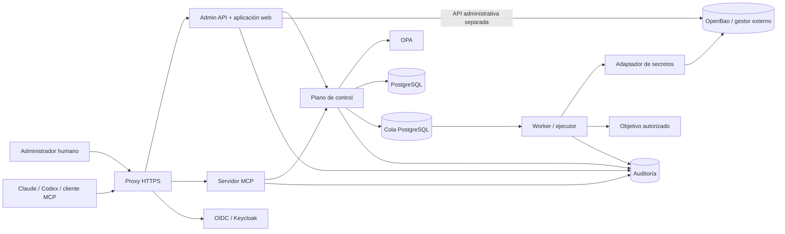

# Stack tecnológico de `secure-it`

## Estado de este documento

Este documento define el stack propuesto para implementar el proyecto. No implica
que los componentes ya estén desarrollados ni que el despliegue de demostración
sea apto para custodiar credenciales reales.

La prioridad es que una persona pueda clonar el repositorio y levantar un entorno
completo con un solo comando, sin mezclar por ello la frontera MCP con la interfaz
humana que puede administrar secretos.

## Decisiones principales

| Área | Elección | Motivo |
|---|---|---|
| Runtime | Node.js LTS con TypeScript | SDK MCP oficial, ecosistema amplio y un solo lenguaje para API, MCP y web |
| Gestor de paquetes | npm workspaces | Viene con Node.js y evita exigir herramientas globales adicionales |
| API HTTP | Fastify para APIs de dominio; Express en el borde MCP | Fastify conserva los contratos internos; el borde usa la integración HTTP y auth mantenida por el SDK MCP oficial |
| Contratos | JSON Schema + TypeBox/Ajv | Permite reutilizar y validar los contratos de `spec/mcp-tools.json` |
| Servidor MCP | SDK oficial de MCP para TypeScript | Soporte de Streamable HTTP sin implementar el protocolo manualmente |
| Interfaz web | React + Vite + TypeScript | Build estático sencillo y componentes reutilizables |
| Estado remoto | TanStack Query | Caché, invalidación y estados de mutaciones predecibles |
| Formularios | React Hook Form con esquemas compartidos | Evita que frontend y backend validen reglas diferentes |
| Base de datos | PostgreSQL | Inventario, auditoría, idempotencia y cola transaccional |
| Acceso SQL | Drizzle ORM + migraciones SQL revisables | Tipado sin ocultar las restricciones ni las políticas de PostgreSQL |
| Gestor de secretos local | OpenBao | API compatible con Vault y distribución abierta para el quickstart público |
| Adaptadores de secretos | Interfaz propia | Permite usar Vault o gestores de AWS, GCP y Azure sin cambiar el dominio |
| Identidad | OpenID Connect/OAuth 2.1 | Sesiones humanas y tokens MCP con un estándar común |
| IdP del entorno local | Keycloak con un realm importable | Entorno reproducible sin acoplar producción a un proveedor |
| Políticas | Open Policy Agent | Autorización determinista, versionable y fuera del LLM |
| Trabajos | Cola en PostgreSQL | Evita Redis/Kafka en la primera versión y conserva idempotencia transaccional |
| Logs | Pino con redacción estructurada | Integración natural con Fastify y reglas explícitas para datos sensibles |
| Telemetría | OpenTelemetry | Trazas y métricas independientes del proveedor |
| Pruebas | Vitest, Testcontainers y Playwright | Unitarias, integración real y flujos de navegador |
| Empaquetado | Docker multi-stage y Docker Compose | Inicio sencillo y artefactos equivalentes entre desarrollo y piloto |
| CI | GitHub Actions | Adecuado para un repositorio público y fácil de replicar |

Las dependencias se fijarán a versiones exactas en `package-lock.json` y las
imágenes a versiones concretas o digest. No se usarán etiquetas `latest`. El major
o la versión LTS se actualizarán mediante PRs automáticos con pruebas, no durante
el arranque de un despliegue.

## Arquitectura de servicios



Todos los servicios backend se construyen desde una sola imagen para reducir el
tiempo de build, pero se ejecutan como procesos y contenedores separados:

- `admin`: sirve el build estático y la API humana de credenciales;
- `mcp`: expone únicamente el endpoint Streamable HTTP de MCP;
- `control-plane`: API interna de dominio, políticas, manifiestos e idempotencia;
- `worker`: consume trabajos firmados y ejecuta un adaptador permitido.

Compartir una imagen no significa compartir identidades. Cada proceso usa una
cuenta, token, conexión de base de datos y red acordes con su función.

## Estructura propuesta del repositorio

```text
secure-it/
├── apps/
│   ├── admin-web/          # React/Vite; nunca recibe tokens generales del gestor
│   ├── admin-api/          # sesión humana y operaciones administrativas
│   ├── mcp/                # tools/list y tools/call
│   ├── control-plane/      # dominio, política, manifiestos y trabajos
│   └── worker/             # ejecutores y adaptadores de transporte
├── packages/
│   ├── auth/               # validación OIDC, roles y scopes
│   ├── contracts/          # esquemas y tipos compartidos
│   ├── database/           # cliente, migraciones y repositorios
│   ├── policies/           # clientes OPA y entradas normalizadas
│   ├── secrets/            # interfaces OpenBao/Vault/cloud
│   ├── audit/              # eventos sin valores secretos
│   └── observability/      # logs, métricas y trazas
├── deploy/
│   ├── compose/            # demo y piloto local
│   ├── keycloak/           # realm y clientes sin claves reales
│   ├── openbao/            # políticas y configuración de desarrollo
│   └── opa/                # políticas Rego y pruebas
├── migrations/             # SQL versionado
├── spec/                   # contratos MCP existentes
├── tests/
│   ├── contract/
│   ├── integration/
│   ├── security/
│   └── e2e/
├── compose.yaml
├── compose.pilot.yaml
├── Dockerfile
├── Makefile
└── .env.example
```

## Perfiles de despliegue

### 1. Demostración local

Objetivo: evaluar la interfaz, el catálogo MCP y los flujos sin infraestructura ni
credenciales reales.

- Arranque previsto: `make demo` o `docker compose up --build`.
- Incluye PostgreSQL, Keycloak, OPA y OpenBao en configuración de desarrollo.
- Carga usuarios, servidores y secretos totalmente ficticios.
- El worker usa exclusivamente `demo-executor`; no abre conexiones SSH ni cloud.
- Las redes del entorno local no se consideran una protección de producción.
- La aplicación muestra permanentemente que el modo demo no admite datos reales.

El modo demo debe rechazar endpoints que no pertenezcan al rango reservado para
ejemplos y no permite desactivar esta restricción con una petición HTTP.

### 2. Piloto autocontenido

Objetivo: pruebas controladas sobre servidores no críticos.

- Arranque previsto: `make pilot` con un archivo `.env` creado desde el ejemplo.
- TLS obligatorio delante de las dos superficies públicas.
- PostgreSQL, Keycloak, OPA y OpenBao usan almacenamiento persistente y secretos
  de bootstrap suministrados fuera del repositorio.
- Las credenciales de servicio son distintas para MCP, administración, plano de
  control y worker.
- El ejecutor real permanece deshabilitado hasta configurar explícitamente un
  adaptador y aprobar sus políticas.
- Copias, restauración, revocación y parada global se prueban antes de cargar un
  secreto real.

Compose facilita el piloto, pero no convierte por sí solo una máquina única en una
plataforma de alta disponibilidad.

### 3. Producción

La primera entrega no debe prometer un despliegue de producción genérico. En esta
fase se reutilizan las mismas imágenes OCI y contratos, pero normalmente se usan:

- PostgreSQL administrado o un clúster con copias y recuperación verificadas;
- proveedor OIDC corporativo en lugar del Keycloak incluido;
- gestor de secretos administrado, OpenBao/Vault endurecido o HSM;
- OPA como sidecar o servicio interno altamente disponible;
- jobs aislados de Kubernetes, Nomad o un daemon local atestado;
- ingress corporativo con TLS, WAF y limitación de tráfico;
- almacén de auditoría append-only independiente.

El manifiesto de Kubernetes o chart Helm se añadirá cuando exista un piloto
validado. Mantenerlo fuera del primer quickstart reduce configuraciones de
producción aparentes pero inseguras.

## Redes y exposición

Compose define al menos estas redes:

| Red | Componentes | Regla |
|---|---|---|
| `edge` | proxy, `admin`, `mcp`, Keycloak | Única red con entrada del usuario |
| `control` | `admin`, `mcp`, plano de control, OPA, PostgreSQL | Sin acceso directo desde Internet |
| `secrets` | `admin`, `worker`, OpenBao | MCP y plano de control no se conectan |
| `execution` | `worker` y destinos permitidos | Egress restringido por adaptador y política |

Solo el proxy publica puertos en el perfil piloto. PostgreSQL, OpenBao, OPA y el
plano de control no publican puertos al host. En desarrollo pueden exponerse en
`127.0.0.1` mediante un perfil de depuración explícito.

## Identidad y autorización

### Sesión administrativa

La interfaz usa Authorization Code con PKCE, cookies `HttpOnly`, `Secure` y
`SameSite=Strict`, protección CSRF y una sesión corta. Revelar o copiar requiere
step-up MFA y un `auth_time` reciente. El navegador nunca recibe el token general
de OpenBao.

Roles iniciales:

- `inventory_viewer`;
- `operator`;
- `credential_manager`;
- `credential_revealer`;
- `approver`;
- `auditor`;
- `platform_admin`.

`credential_manager` puede crear, sustituir, rotar y revocar, pero no hereda
`credential_revealer`. Los permisos se vuelven a evaluar por ambiente, propietario
y credencial exacta.

### MCP

El servidor MCP valida firma, emisor, audiencia, expiración y scopes del bearer
token en cada petición. Conserva los scopes definidos en
`docs/09-servidor-mcp.md` y nunca acepta roles declarados dentro de argumentos de
herramientas.

Las operaciones administrativas ciegas que se incorporen después tendrán
herramientas y scopes específicos. No existirá `credentials.get`, un enlace de
revelado ni un scope MCP equivalente a `credential_revealer`.

### Servicios internos

En Compose se usan credenciales de servicio distintas y de alcance mínimo. Para
producción, el objetivo es identidad de carga de trabajo mediante SPIFFE/SPIRE o
la identidad nativa de la plataforma. Un token de usuario nunca se reenvía a
PostgreSQL, OPA, OpenBao, el worker o un objetivo.

## Datos e inventario

PostgreSQL contiene:

- inventario y endpoints de administración;
- perfiles y bindings con referencias opacas;
- definiciones de acciones versionadas;
- solicitudes, aprobaciones, trabajos y resultados sanitizados;
- claves de idempotencia;
- metadatos del ciclo de vida de credenciales;
- eventos de auditoría sin valores secretos.

No contiene contraseñas, claves privadas, tokens, cuerpos enviados al gestor ni
salidas completas de procesos. Las migraciones activan restricciones SQL, roles
separados y Row Level Security donde corresponda. Los datos semilla solo contienen
identidades y secretos ficticios del modo demo.

La cola inicial usa filas con estado, lease corto y `FOR UPDATE SKIP LOCKED`. Esto
permite recuperar workers caídos sin introducir otra dependencia. Si las métricas
demuestran que PostgreSQL es insuficiente, se evaluará NATS JetStream o un servicio
de colas administrado; Redis/Kafka no forman parte del stack inicial.

## Gestor de secretos

El paquete `secrets` define operaciones estrechas:

- crear una versión;
- leer una versión exportable para una sesión humana autorizada;
- promover o revocar una versión;
- emitir una capacidad temporal;
- obtener metadatos no sensibles;
- verificar salud.

El adaptador de OpenBao es la referencia local. Otros proveedores implementan el
mismo contrato sin exponer su ruta, token o respuesta al dominio. El backend
administrativo usa una identidad diferente de la del broker del worker.

Las respuestas de lectura usan `Cache-Control: no-store`, nunca una URL con el
secreto y nunca `GET`. Los bodies sensibles se excluyen de logs, trazas, errores y
capturas automáticas. JavaScript no permite prometer borrado determinista de
memoria; por ello los valores se mantienen durante el menor tiempo posible y el
proceso administrativo conserva una superficie mínima.

## Interfaz administrativa

La primera interfaz incluye:

- dashboard de estado sin secretos;
- inventario de credenciales por alias, ambiente, propietario y vencimiento;
- alta/importación directa al gestor;
- sustitución de un valor ya cambiado en el objetivo;
- solicitud de rotación transaccional;
- prueba, revocación y retiro de bindings;
- revelado/copia individual con reautenticación;
- historial de operaciones y aprobaciones.

No incluye exportación masiva, presentación de tokens del gestor, edición de rutas
internas ni claves administrativas descargables. Las operaciones de copia generan
un evento, vuelven a enmascarar el valor y advierten que limpiar el portapapeles es
una reducción de riesgo, no una garantía.

La interfaz debe funcionar con teclado, incluir estados de carga/error visibles y
no depender únicamente del color para comunicar riesgo. Se usarán componentes
accesibles sin adoptar una librería visual pesada en la primera versión.

## MCP y contratos

`spec/mcp-tools.json` es la fuente del catálogo público inicial. Durante el build:

1. se valida cada `inputSchema` y `outputSchema`;
2. se generan tipos TypeScript cuando sea conveniente;
3. Fastify y el SDK MCP usan los mismos esquemas;
4. pruebas de contrato verifican que `structuredContent` cumpla el esquema;
5. una diferencia incompatible exige versionar la herramienta.

El transporte de producción es Streamable HTTP. `stdio` se ofrece únicamente como
puente local sin acceso a secretos. Operaciones largas devuelven `job_id`; no se
depende de extensiones MCP Tasks en la primera versión.

La fase HTTP inicial de `apps/mcp` usa Express exclusivamente como adaptador del
`StreamableHTTPServerTransport` y del middleware OAuth del SDK oficial. Esta
excepción evita implementar manualmente la negociación MCP. No cambia la elección
de Fastify para las futuras APIs administrativa y del plano de control, ni mezcla
handlers MCP con autorización o lógica de dominio.

## Ejecución y adaptadores

El repositorio nace con dos clases de adaptador:

- `demo-executor`: produce resultados sintéticos deterministas y es el único
  habilitado por defecto;
- interfaz `executor`: contrato para daemon local, certificados SSH efímeros o API
  cloud, sin una implementación privilegiada activada automáticamente.

No se monta `/var/run/docker.sock`, no se ejecuta `sh -c`, no se hereda el entorno
del worker y no existe shell interactiva. Un adaptador real debe declarar redes,
usuario, límites, filtros de salida, reversión y pruebas negativas antes de poder
registrarse.

En un piloto basado en Docker, el worker despacha a un servicio ejecutor dedicado;
no crea contenedores usando el socket del host. En Kubernetes, cada trabajo puede
convertirse en un Job con ServiceAccount, NetworkPolicy y volumen efímero propios.

## Observabilidad y auditoría

- Logs JSON mediante Pino, con allowlist de campos y redacción centralizada.
- IDs de correlación desde MCP o administración hasta auditoría y resultado.
- OpenTelemetry para métricas y trazas sin parámetros sensibles.
- Endpoint de salud separado de readiness; ninguno revela configuración.
- Auditoría append-only con una interfaz distinta de los logs operativos.
- Alertas por revelado, denegaciones, selectores amplios, fallos de política,
  detección de secretos y workers atascados.

Prometheus y Grafana se ofrecen mediante un perfil Compose opcional para no hacer
pesado el quickstart. Producción puede exportar OTLP a la plataforma existente.

## Seguridad del repositorio público

- `.env.example` contiene nombres y valores ficticios, nunca credenciales válidas.
- `.gitignore` excluye `.env`, certificados, bases locales, dumps y artefactos.
- Gitleaks bloquea secretos en commits y en CI.
- Dependabot o Renovate crea actualizaciones revisables.
- CodeQL, auditoría de npm, Trivy y SBOM CycloneDX revisan código e imágenes.
- Docker corre como usuario no root, con filesystem de solo lectura cuando sea
  posible y capacidades Linux eliminadas.
- Los ejemplos usan dominios `.example`, UUIDs y rangos IP reservados.
- Los errores y fixtures pasan pruebas automáticas de detección de secretos.
- Ningún bootstrap de Keycloak/OpenBao destinado a un piloto se almacena en Git.

Antes de publicar se debe elegir y añadir una licencia explícita, política de
seguridad (`SECURITY.md`), guía de contribución y proceso de reporte privado de
vulnerabilidades.

## Experiencia de desarrollo

Comandos previstos:

```text
make demo          # levanta el entorno seguro de demostración
make down          # detiene servicios sin borrar datos
make reset-demo    # recrea únicamente los volúmenes identificados del demo
make lint          # formato, tipos y políticas
make test          # unitarias y contratos
make test-e2e      # navegador y clientes MCP
make security      # secretos, dependencias, imágenes y SBOM
```

`make reset-demo` será el único comando destructivo y comprobará el nombre exacto
del proyecto Compose antes de eliminar volúmenes. El README mostrará primero el
quickstart y después las advertencias para piloto; no requerirá conocer la
arquitectura completa para ver la demo.

## Estrategia de pruebas

1. **Unitarias:** normalización, políticas, filtrado, hashing e idempotencia.
2. **Contratos:** cada herramienta MCP y endpoint contra su JSON Schema.
3. **Integración:** PostgreSQL, OPA, Keycloak y OpenBao reales con Testcontainers.
4. **E2E:** login, alta, revelado autorizado, copia, rotación y auditoría con
   Playwright; pruebas desde al menos dos clientes MCP.
5. **Negativas:** sesión MCP contra API administrativa, scopes cruzados, SSRF,
   DNS rebinding, inyección, replay, caída de dependencias y fuga en logs.
6. **Suministro:** lockfile reproducible, SBOM, firmas y escaneo de imagen.

Una prueba de revelado nunca usa una credencial real. Los valores sintéticos se
marcan para que el detector pueda confirmar que no llegaron a logs o trazas.

## Orden de implementación recomendado

1. Workspace, calidad, configuración, imagen y Compose de demostración.
2. Migraciones, roles SQL, datos sintéticos y auditoría.
3. OIDC, sesiones administrativas, scopes MCP y cliente OPA.
4. Plano de control de inventario y catálogo de acciones de solo lectura.
5. Servidor MCP conforme a `spec/mcp-tools.json`.
6. Consola administrativa de metadatos, sin revelado habilitado.
7. Adaptador OpenBao para alta/importación y operaciones ciegas.
8. Revelado/copia después de completar step-up, auditoría y pruebas negativas.
9. Cola PostgreSQL y `demo-executor`.
10. Primer adaptador real únicamente para objetivos no críticos del piloto.

## Elementos excluidos del stack inicial

- Redis, Kafka o un service mesh;
- GraphQL;
- microservicio separado por cada entidad;
- Kubernetes obligatorio para desarrollo;
- shell SSH interactiva;
- ejecución real habilitada en el quickstart;
- almacenamiento de secretos en PostgreSQL;
- aprobación de producción por MCP;
- exportación masiva de credenciales;
- lógica de autorización específica para Claude, Codex u otro modelo.

Estas exclusiones mantienen el despliegue comprensible y reducen componentes sin
relajar las fronteras de seguridad definidas por el proyecto.

## Criterios para comenzar a programar

Antes de crear el scaffold deben confirmarse estas decisiones:

- Node.js/TypeScript como runtime común;
- OpenBao como backend local de referencia;
- Keycloak solo como IdP reproducible, sin imponerlo en producción;
- OPA desde la primera versión, no autorización delegada al frontend;
- PostgreSQL como inventario, auditoría y cola inicial;
- Compose para demo/piloto y Kubernetes posterior;
- worker real deshabilitado por defecto;
- revelado disponible únicamente en la consola humana separada.

Una vez confirmadas, el primer entregable será el entorno demo completo con datos
sintéticos. No se cargará ninguna credencial real durante el desarrollo inicial.
