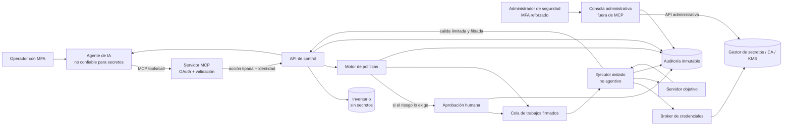

# Arquitectura de referencia

## Vista general

Los únicos componentes con una ruta al gestor de secretos son el broker y el
backend de la consola administrativa. El agente y el servidor MCP no comparten
identidad, token, socket, volumen ni cuenta de sistema con ellos o con el ejecutor.
El token OAuth recibido por MCP nunca se reenvía a esos componentes ni se convierte
en credencial SSH.

El backend administrativo puede gestionar y, bajo política explícita, leer
secretos exportables para un humano autorizado. No comparte sesión, API,
credenciales de servicio ni ruta de red con MCP. La consola no es una herramienta
que el agente pueda abrir o controlar y todas sus operaciones se auditan sin
registrar los valores. Véase
[Interfaz administrativa de credenciales](10-interfaz-administrativa-credenciales.md).

## Fronteras de confianza

### 1. Zona del agente

Contiene el LLM, historial, recuperación documental y adaptadores de herramientas.
Debe asumirse comprometible por inyección de prompt. Solo recibe:

- identificadores lógicos y metadatos mínimos del inventario;
- catálogo de acciones permitido para el usuario;
- estados de trabajos;
- resultados reducidos y clasificados.

No puede ver direcciones de administración si no son necesarias, referencias de
secretos, reglas internas de detección, tokens de aprobación ni datos de otros
usuarios.

### 1.5. Frontera MCP

Expone herramientas estables a cualquier cliente compatible. Autentica cada
petición, valida el esquema, deriva la identidad humana y llama al plano de control
con una identidad interna distinta. No contiene claves SSH ni acceso directo al
gestor de secretos. El catálogo completo está en
[Diseño del servidor MCP](09-servidor-mcp.md).

### 2. Plano de control

Es software determinista. Valida esquemas, resuelve objetivos, congela el conjunto
de destinos, calcula el riesgo, consulta políticas y verifica aprobaciones. Firma
un manifiesto de trabajo inmutable que incluye:

- `request_id` y clave de idempotencia;
- identidad del solicitante y, cuando corresponda, del aprobador;
- acción y versión;
- parámetros normalizados;
- lista exacta de objetivos;
- versión o hash de la política evaluada;
- instante de creación y caducidad;
- límites de tiempo, concurrencia y salida.

El ejecutor rechaza cualquier trabajo con firma inválida, vencido o ya consumido.

### 3. Plano de ejecución

Cada trabajo corre en un entorno desechable, sin shell interactiva, sin montar el
socket del contenedor anfitrión, sin credenciales heredadas y con salida a red
limitada al objetivo, al broker y a la auditoría. El ejecutor:

- interpreta una especificación conocida; no texto libre del modelo;
- construye `argv` sin invocar `sh -c`;
- aplica usuario, grupo, límites de recursos y tiempo;
- obtiene una capacidad solo después de validar el manifiesto;
- borra material efímero al terminar;
- limita y filtra la salida antes de devolverla.

El proceso hijo que implementa una acción no debe heredar el token del broker, el
socket de un agente SSH, credenciales cloud generales ni variables innecesarias.

### 4. Plano de secretos

Custodia raíces, credenciales heredadas y emisores de capacidades. Autentica al
broker por identidad de carga de trabajo y aplica sus propias políticas. Nunca
confía únicamente en una decisión enviada por el agente.

La rotación se realiza dentro de esta frontera. El broker y un adaptador
determinista actualizan el objetivo, verifican la nueva versión y revocan la
anterior. Al agente solo se le comunica estado, fecha, versión no sensible y
evidencia de verificación.

El mismo plano expone una API administrativa distinta para la consola humana. Su
autorización distingue gestión, rotación, revocación y revelado; el permiso de
administrar no implica automáticamente permiso de leer valores.

## Patrones de conexión

### Patrón recomendado: daemon local e identidad de carga

Un daemon pequeño y no agentivo en cada servidor mantiene una identidad de carga
de trabajo, recibe trabajos firmados y ejecuta plugins locales permitidos. Así no
hay contraseñas SSH centrales. Sus claves deben rotarse automáticamente y, cuando
sea posible, almacenarse en TPM, HSM o keystore no exportable.

Ventajas: menor concentración de credenciales, identidad por máquina, revocación
precisa y mejor control local. Coste: desplegar, actualizar y proteger el daemon.

### Compatibilidad: SSH con certificado efímero

Para servidores heredados, el ejecutor genera un par de claves por trabajo y el
broker solicita que una CA firme la clave pública con:

- vida de pocos minutos;
- principal específico;
- identificador del trabajo;
- sin reenvío de agente, puertos ni X11;
- sin PTY salvo justificación;
- rol y objetivos restringidos.

El servidor confía en la CA y restringe ese principal mediante `sshd`, comandos
forzados o `sudo` acotado. La clave privada solo existe dentro del ejecutor y no se
expone al proceso de la acción cuando la biblioteca de transporte permite mantener
esa separación.

### Nube y servicios administrados

Usar federación de identidad y tokens STS de corta duración, ligados a rol y
sesión. Evitar claves de acceso estáticas. El broker pide el rol mínimo para el
trabajo; el agente nunca recibe el token ni una consola genérica.

## Tres capacidades diferentes

Es importante no llamar “token temporal” a cosas con poderes distintos:

1. **Sesión de la herramienta:** autentica la integración ante el plano de control.
   Debe vivir en el adaptador de herramientas, no en el texto del prompt, y usar
   prueba de posesión cuando sea posible.
2. **Manifiesto de ejecución:** autorización firmada, de un solo uso, ligada a una
   acción, parámetros y objetivos. El agente solo necesita su identificador.
3. **Credencial del objetivo:** certificado SSH, identidad mTLS o token STS que
   usa el ejecutor. Nunca sale del plano de ejecución/secretos.

Confundir estas piezas puede convertir un token supuestamente seguro en una llave
general. La caducidad reduce la ventana de abuso, pero no sustituye el alcance
mínimo, la audiencia, el nonce, la idempotencia y la vinculación criptográfica.

## Flujo de una ejecución

1. El operador pide: “revisa uso de disco en servidores web de pruebas”.
2. El agente selecciona `os.disk_usage@1` y el selector `env=test,role=web`.
3. La API autentica, valida parámetros y resuelve el selector a una lista fija.
4. El motor de políticas devuelve `allow`, riesgo, límites y aprobación requerida.
5. Si aplica, un humano aprueba exactamente el hash del manifiesto.
6. La cola entrega el manifiesto una sola vez a un ejecutor elegible.
7. El broker emite una capacidad efímera para ese trabajo y esos destinos.
8. El ejecutor realiza la acción y transmite eventos de auditoría.
9. La capacidad expira o se revoca, y el entorno se destruye.
10. La API devuelve un resumen filtrado al agente.

Cambiar parámetros u objetivos después de la aprobación invalida su firma y exige
una nueva evaluación.

## Componentes intercambiables

La arquitectura no exige un proveedor concreto. Una implementación inicial puede
usar PostgreSQL para inventario, OIDC para personas, SPIFFE/SPIRE o identidad
nativa de la plataforma para servicios, Open Policy Agent para políticas y Vault
o un gestor cloud para emisión de capacidades. Cada sustitución debe conservar las
fronteras y propiedades, no solo replicar nombres de productos.
