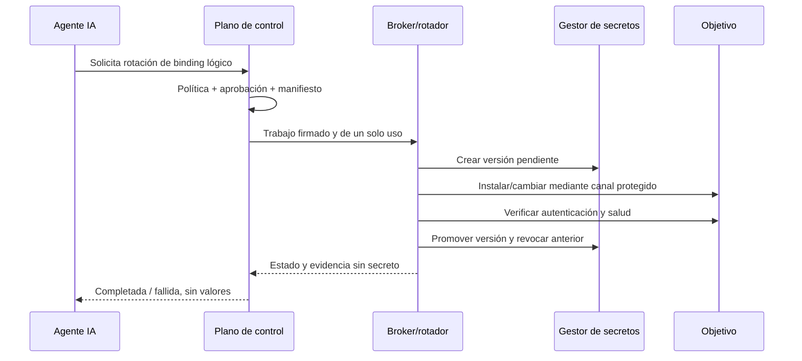

# Recuperación y rotación de credenciales

## Acción inmediata ante exposiciones anteriores

Toda credencial entregada a un agente, pegada en un prompt o capturada por una
herramienta debe considerarse comprometida, aunque el proveedor afirme no usar el
contenido para entrenamiento. Puede persistir en historial, telemetría, copias,
trazas, capturas o sistemas de terceros.

Para cada exposición:

1. Identificar tipo, alcance, propietario, sistemas y fecha de exposición.
2. Revocar primero cuando exista una vía alternativa de acceso segura.
3. Rotar el valor y no reutilizarlo en ningún sistema.
4. Invalidar certificados, tokens, sesiones y claves derivadas cuando aplique.
5. Buscar uso anómalo desde el momento de exposición.
6. Eliminar el valor de repositorios, tickets, logs y memorias bajo las políticas
   de cada sistema; esto reduce exposición, pero no reemplaza la revocación.
7. Registrar el incidente sin copiar el secreto y verificar el nuevo acceso.
8. Migrar el mecanismo a identidad de carga, CA o emisión dinámica para evitar
   que vuelva a existir una credencial compartida de larga duración.

Si aún hay credenciales expuestas activas, este procedimiento tiene prioridad
sobre construir el agente.

## Rotación solicitada por el agente

El agente puede pedir “rota el acceso de los servidores web”, pero su herramienta
solo envía objetivo lógico, binding y motivo. No acepta un valor elegido por el
modelo y no devuelve el valor generado.

Ante una petición de “dame la credencial”, el contrato responde `operation_not_available`.
No es una denegación decidida por el LLM: ninguna identidad o ruta de red de su
zona posee una operación de lectura. Las alternativas expuestas son
`validate_access`, `rotate_access` y las acciones ciegas autorizadas.

## Protocolo para secretos estáticos heredados

Cuando no sea posible sustituir una contraseña de inmediato:

1. El gestor genera aleatoriamente una versión `pending`; ni usuario ni agente la
   eligen.
2. El rotador obtiene exactamente esa versión usando una identidad por trabajo.
3. Un conector dedicado cambia la credencial en el objetivo sin ponerla en `argv`,
   salida, archivo persistente o variable heredable.
4. Otro paso verifica autenticación y una comprobación mínima de salud.
5. Solo después se marca `current` y comienza una ventana corta de solapamiento si
   el sistema la soporta.
6. Se revoca `previous`, se invalidan sesiones y se borra el entorno efímero.
7. Si falla antes de la promoción, se elimina `pending`. Si falla después, se usa
   el procedimiento de recuperación previamente ensayado.

No todos los sistemas permiten una transición atómica. Para cada adaptador debe
documentarse si soporta dos credenciales simultáneas, reversión, revocación de
sesiones y cómo evita dejar al equipo fuera del servidor.

## Preferencia por eliminar la rotación de contraseñas

El orden recomendado de mecanismos es:

1. identidad de carga atestada con claves no exportables y rotación automática;
2. certificados o tokens dinámicos de corta duración;
3. certificados SSH por trabajo;
4. secretos estáticos con rotación automatizada;
5. contraseña compartida manual, solo como deuda temporal.

Con credenciales dinámicas, la operación normal es emitir y expirar, no distribuir
un nuevo secreto permanente. Se conservan las raíces y emisores bajo controles más
fuertes y separados.

## Política de frecuencia

No debe fijarse una única frecuencia para todos los secretos. El registro de cada
binding define máximo de vida, capacidad de revocación, impacto y propietario.

- Capacidades de trabajos: segundos o pocos minutos, sin renovación por el agente.
- Certificados de carga: cortos y renovados automáticamente antes de expirar.
- Credenciales estáticas heredadas: intervalo basado en riesgo y capacidad del
  sistema, más rotación inmediata por exposición, cambio de personal, incidente o
  sospecha de uso.
- Raíces de CA: vida mayor, custodia offline/HSM y rotación ceremonial ensayada;
  no se manipulan mediante el agente.

La plataforma alerta antes del vencimiento, pero el propietario conserva un camino
humano de recuperación probado.

## Evidencia visible en MCP, secreto invisible

El usuario, cuando opera a través del agente, y el propio agente sí pueden recibir:

- binding y objetivos afectados;
- estado y tiempos;
- número/fingerprint público de certificado cuando sea seguro;
- identificador opaco de versión;
- prueba de conexión y salud;
- fecha de expiración y próxima rotación;
- identidad de solicitante y aprobador.

MCP nunca devuelve el valor, una URL de un solo clic para leerlo, el token del
gestor, un comando con el valor incrustado ni la salida cruda del conector de
rotación. Un administrador humano puede revelar ciertos secretos exportables solo
mediante la consola separada y bajo los controles descritos en
[Interfaz administrativa de credenciales](10-interfaz-administrativa-credenciales.md).
